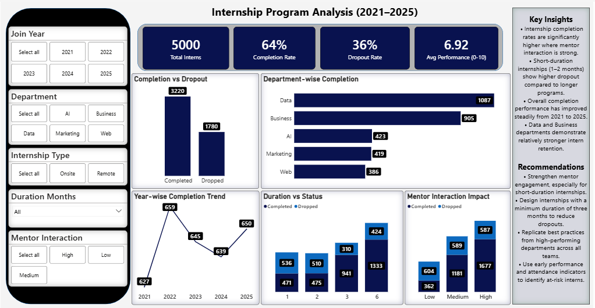
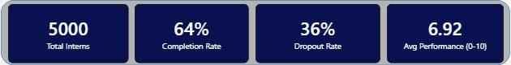
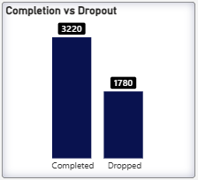
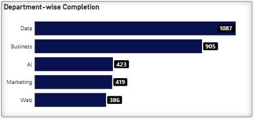
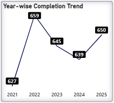
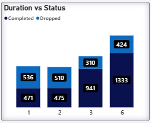
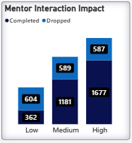
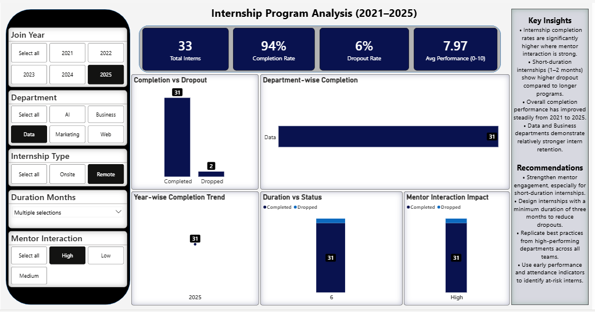
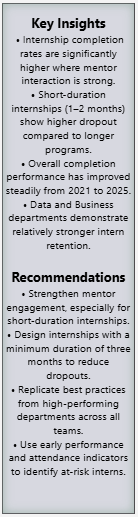

# 📊 Internship Program Analysis

## 📌 Project Overview

This project analyzes internship program data to identify **completion trends**, **dropout behavior**, 
**departmental performance**, **year-wise progress**, **internship duration impact**, and 
**mentor interaction influence** using an interactive **Power BI dashboard**.

The analysis enables stakeholders to evaluate **intern retention patterns over time**, compare performance 
**across departments**, assess the effect of **internship duration**, and understand how **mentor engagement** 
impacts successful internship completion.

---

## ❓ Business Questions Addressed

- Which departments have the highest internship completion rates?
- How does internship duration impact dropout behavior?
- What role does mentor interaction play in intern success?
- Are insights consistent across different filters and cohorts?

---

## 🛠️ Tools & Technologies

- **Power BI** — Data modeling, DAX measures, and interactive dashboard
- **Microsoft Excel** — Source dataset
- **GitHub** — Version control and project documentation

---

## 📂 Project Structure
```
Internship-Program-Analysis/
│
├── 📂 Data/
│   └── 📄 Internship_Program_Data.xlsx
│
├── 📂 PowerBI/
│   └── 📊 Internship_Program_Performance_Analysis.pbix
│
├── 📂 Screenshots/
│   ├── 🖼️ 01_dashboard_overview.PNG
│   ├── 🖼️ 02_kpi_summary.PNG
│   ├── 🖼️ 03_completion_vs_dropout.PNG
│   ├── 🖼️ 04_department_wise_completion.PNG
│   ├── 🖼️ 05_year_wise_trend.PNG
│   ├── 🖼️ 06_duration_vs_status.PNG
│   ├── 🖼️ 07_mentor_interaction_impact.PNG
│   ├── 🖼️ 08_filters_interactivity.PNG
│   └── 🖼️ 09_final_insights_recommendations.PNG
│
└── 📄 README.md
```

---

## 🖼 Dashboard Screenshots (Visual Walkthrough)

### 1️⃣ Full Dashboard Overview


---

### 2️⃣ KPI Summary Cards


---

### 3️⃣ Completion vs Dropout Analysis


---

### 4️⃣ Department-wise Completion


---

### 5️⃣ Year-wise Completion Trend


---

### 6️⃣ Duration vs Status


---

### 7️⃣ Mentor Interaction Impact


---

### 8️⃣ Filters & Interactivity


---


### 9️⃣ Key Insights & Recommendations


---

## ⭐ Notes

- All visuals are **filter-responsive**
- Insights remain **logically consistent** across slicer combinations
- Designed following **industry-standard dashboard practices**

---

## 🔍 Key Insights
- Internship completion rates are significantly higher where **mentor interaction is strong**.
- **Short-duration internships (1–2 months)** show higher dropout compared to longer programs.
- Overall completion performance improves steadily across years.
- **Data and Business departments** demonstrate relatively stronger intern retention.

---

## ✅ Recommendations
- Strengthen mentor engagement, especially for short-duration internships.
- Design internships with a **minimum duration of three months** to reduce dropouts.
- Replicate best practices from high-performing departments across all teams.
- Use early performance and attendance indicators to identify **at-risk interns**.

---

## 📎 Power BI File

You can access the complete interactive dashboard here:

👉 **Power BI Dashboard File:**  
[Internship_Program_Performance_Analysis.pbix](PowerBI/Internship_Program_Performance_Analysis.pbix)

---

## 🌐 Live Dashboard (Power BI Service)

The dashboard has been published to Power BI Service for internal workspace access.

🔒 Due to organizational access restrictions, the live link requires Microsoft workplace authentication.

📎 The complete `.pbix` file is provided in this repository for full review.

---

## 👤 Author

**Hafiz Zaman Yaseen**  
Aspiring Data Analyst | Data Visualization & Insights  
Excel • SQL • Power BI • Python  

📧 Email: zamanyaseen.71@gmail.com  
🔗 GitHub: https://github.com/zaman-dataanalyst  
🔗 LinkedIn: https://www.linkedin.com/in/zaman-dataanalyst/

